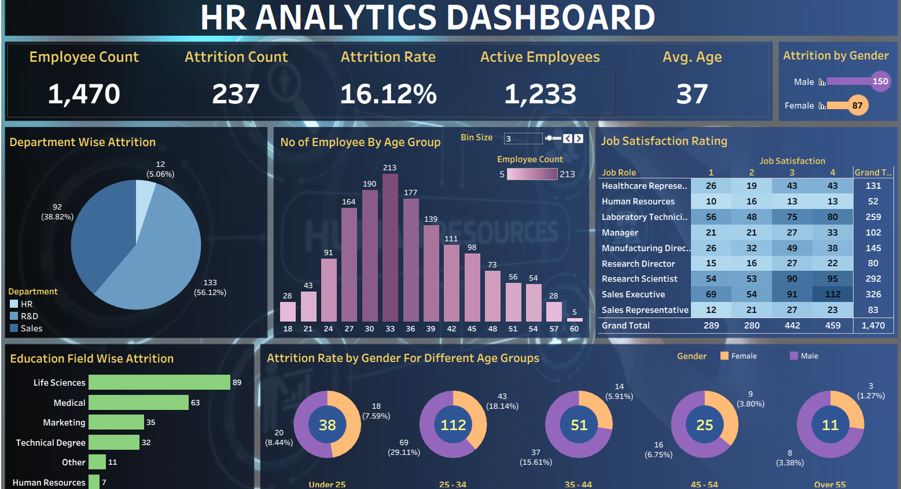

# 📊 HR Analytics Dashboard
<div align="center">


</div>
<div align="center">


**An end-to-end HR Analytics dashboard built in Tableau to analyze employee attrition, satisfaction, and workforce demographics.**

</div>

---

## 📌 Overview

This project explores **employee attrition patterns** across a fictional organization of **1,470 employees**, using a single interactive Tableau dashboard. It combines KPI summary cards, categorical breakdowns, and cross-tabulations to help HR teams quickly spot **who is leaving, from where, and why**.

The dashboard answers questions like:
- What is the overall attrition rate, and how many employees are currently active?
- Which departments and education fields see the highest attrition?
- How does attrition vary by gender across different age groups?
- How satisfied are employees, broken down by job role?
- What does the age distribution of the workforce look like?

---

## 🖼️ Dashboard Preview

<div align="center">



</div>

---

## 🚀 Key Features

| Feature | Description |
|---|---|
| 📈 **KPI Summary Cards** | Employee Count, Attrition Count, Attrition Rate, Active Employees, and Average Age at a glance |
| 🧑‍🤝‍🧑 **Attrition by Gender** | Horizontal bar comparison of male vs. female attrition counts |
| 🥧 **Department Wise Attrition** | Pie chart showing attrition share across HR, R&D, and Sales |
| 📊 **Age Group Distribution** | Histogram of employee counts with an adjustable bin size control |
| 🗂️ **Job Satisfaction Matrix** | Cross-tab of job satisfaction scores (1–4) by job role |
| 🌿 **Education Field Wise Attrition** | Bar chart ranking attrition by education background |
| 🍩 **Attrition Rate by Gender & Age** | Donut charts segmenting attrition rate across five age bands |

---

## 🗃️ Data Source

The dashboard is powered by `HR_Data.xlsx`, a single sheet (**"HR data"**) containing **1,470 employee records** with **38 attributes**, including:

<details>
<summary><b>Click to expand full column list</b></summary>

- Attrition, CF_attrition label, CF_age band, CF_current Employee
- Department, Job Role, Education Field, Education
- Age, Gender, Marital Status, Over18
- Business Travel, Distance From Home, Over Time
- Employee Number, emp no, Employee Count
- Daily Rate, Hourly Rate, Monthly Income, Monthly Rate, Percent Salary Hike
- Job Level, Job Involvement, Job Satisfaction, Environment Satisfaction, Relationship Satisfaction, Work Life Balance
- Num Companies Worked, Total Working Years, Years At Company, Years In Current Role, Years Since Last Promotion, Years With Curr Manager
- Performance Rating, Training Times Last Year, Stock Option Level, Standard Hours

</details>

> 💡 Calculated fields such as `CF_age band`, `CF_attrition label`, and `CF_current Employee` are pre-built in the Tableau workbook to simplify grouping and filtering.

---

## 🧰 Tools & Tech Stack

- **Tableau Desktop / Public** — dashboard design & interactivity
- **Microsoft Excel** — source data storage (`HR_Data.xlsx`)
- **Tableau Workbook (.twb)** — dashboard definition file

---

## 📂 Repository Structure

```
📦 hr-analytics-dashboard
├── 📄 Dashboard.twb          # Tableau workbook (dashboard + all worksheets)
├── 📊 HR_Data.xlsx           # Source dataset (1,470 employees, 38 fields)
├── 🖼️ Out_put_image.png      # Full dashboard screenshot / preview
├── 🖼️ HR_background_pptx.png # Dashboard background design asset
└── 📄 README.md              # Project documentation (this file)
```

---

## 🧩 Worksheets Included in the Workbook

| Worksheet | Insight |
|---|---|
| `KPI` | High-level summary metrics |
| `Attrition by Gender` | Male vs. female attrition counts |
| `Department Wise Attrition` | Attrition share by department |
| `Education Field Wise Attrition` | Attrition by education background |
| `Job Satisfaction Rating` | Job satisfaction matrix by role |
| `Attrition Rate by Gender For Different Age Groups` | Attrition rate segmented by gender and age band |

---

## ▶️ How to Use

1. **Clone this repository**
   ```bash
   git clone https://github.com/<your-username>/hr-analytics-dashboard.git
   cd hr-analytics-dashboard
   ```
2. **Open the dashboard**
   - Install [Tableau Desktop](https://www.tableau.com/products/desktop) or [Tableau Reader](https://www.tableau.com/products/reader) (free).
   - Open `Dashboard.twb` in Tableau.
3. **Explore interactively**
   - Use the **Bin Size** control on the Age Group chart to adjust histogram granularity.
   - Click on any pie slice, bar, or donut segment to cross-filter the entire dashboard.
   - Hover over any chart element for detailed tooltips.
4. *(Optional)* To publish online, upload the workbook to [Tableau Public](https://public.tableau.com/) and embed the generated link/iframe in this README.

---

## 📊 Key Insights

- **Overall attrition rate: 16.12%** — 237 out of 1,470 employees have left.
- **Sales (56.12%) and R&D (38.82%)** together account for the vast majority of attrition, while **HR contributes just 5.06%**.
- Attrition skews toward **younger employees**: the **25–34 age band** alone accounts for the largest share of departures (112 employees, ~29% attrition rate in that group).
- **Life Sciences and Medical** are the top two education fields associated with attrition.
- Male employees show a notably higher attrition count (150) compared to female employees (87).

---

## 🔮 Future Enhancements

- [ ] Add predictive attrition risk scoring (e.g., logistic regression / ML model)
- [ ] Publish live dashboard to Tableau Public and embed here
- [ ] Add filters for tenure, income band, and overtime status
- [ ] Build a companion Python/Power BI version for comparison

---

## 🤝 Contributing

Contributions, suggestions, and feature requests are welcome! Feel free to open an issue or submit a pull request.


## 🙋 Author

**Your Name**
📧 raviteja.challa017@gmail.com 🔗 [LinkedIn](https://www.linkedin.com/in/ch-ravi-teja-b00139367/) · 💼 [Portfolio](https://raviteja0710.netlify.app/)
<div align="center">

⭐ *If you found this project useful, consider giving it a star!* ⭐

</div>

(add an employee image below div tag in start of the page and give samecode in return)
